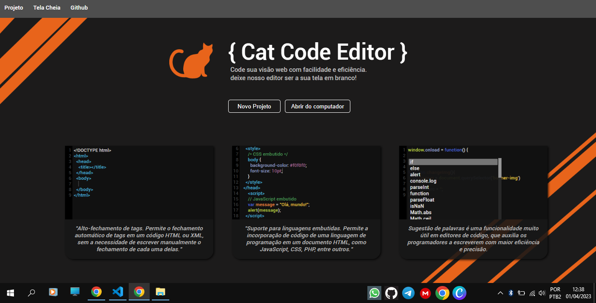

## Sobre

O Cat Code Editor é um editor de código intuitivo projetado para pequenos desenvolvimentos web. Ele oferece um conjunto de recursos para edição de código em linguagens de programação como HTML, CSS e JavaScript.

Com uma interface fácil de usar, o Cat Code Editor é ideal para desenvolvedores de todos os níveis de habilidade. Ele possui uma variedade de recursos para agilizar o processo de desenvolvimento web, incluindo destaque de sintaxe, sugestões de código, formatação automática, autocompletar e muito mais.
* Com sua combinação de recursos poderosos e interface amigável, o Cat Code Editor é a escolha ideal para desenvolvedores web que buscam aumentar sua produtividade e eficiência na criação de aplicativos web modernos e dinâmicos.

## Funcionalidades

* <b>Autocomplete:</b> A função de autocomplete é uma ferramenta que sugere automaticamente o código que pode ser usado para completar uma palavra ou linha de código enquanto você digita no editor. Ele pode economizar muito tempo, especialmente para aqueles que estão trabalhando em projetos grandes ou complexos.

* <b>Realce de sintaxe:</b> A função de realce de sintaxe é usada para colorir o texto no editor de código de acordo com a sintaxe de programação usada. Isso torna mais fácil identificar diferentes elementos do código e entender sua função.

* <b>Sugestão de palavras:</b> A função de sugestão de palavras é um recurso que ajuda os usuários a encontrar a palavra certa enquanto digitam. Ele sugere palavras com base nas letras digitadas, o que economiza tempo e minimiza erros de digitação.

* <b>Autofechamento de tags:</b> A função de autofechamento de tags é usada em linguagens de marcação, como HTML e XML, para fechar automaticamente as tags enquanto você digita. Isso pode ser útil quando se trabalha com tags complexas que possuem muitos atributos. O recurso evita erros de sintaxe e economiza tempo, pois você não precisa digitar a tag de fechamento manualmente.

* <b>Visualização mobile:</b> A função de visualização mobile em um editor de código permite que os desenvolvedores visualizem seus projetos como seriam exibidos em dispositivos móveis. Isso ajuda a garantir que o layout e o design do projeto sejam responsivos e se adaptem adequadamente a diferentes tamanhos de tela.

* <b>Visualização web:</b> A função de visualização web em um editor de código permite que os desenvolvedores visualizem seus projetos em um navegador da web. Isso ajuda a garantir que o layout, o design e a funcionalidade do projeto funcionem corretamente em diferentes navegadores e dispositivos. A visualização web também ajuda a identificar problemas de compatibilidade do navegador

## Colaboradores

* Felipe Miguins
* Leonel Miguins
* Manuel Chave
* Felipe Sander